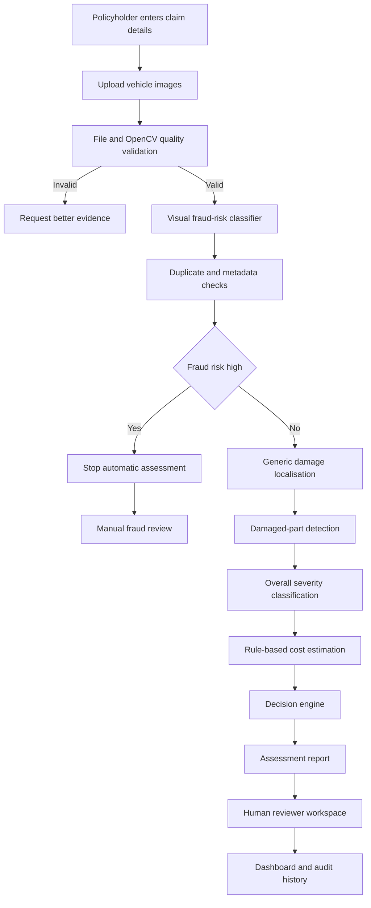
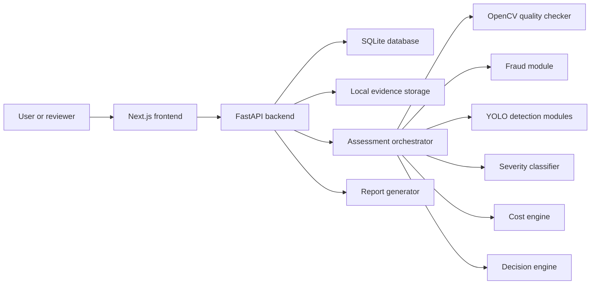

# ClaimVision AI Complete Implementation Plan

> This README is the controlling implementation specification for DEV NEXUS, Codex, Antigravity, and every team member working on the project. Read it completely before creating or editing code. Implement the phases in order. Do not silently change architecture, labels, datasets, thresholds, API contracts, database schemas, or the project scope.

## 1 Project summary

ClaimVision AI is an AI-assisted vehicle insurance claim triage system. A policyholder submits claim information and photographs of a damaged vehicle. The system checks whether the evidence is usable, produces a visual fraud-risk score, identifies visible damage and damaged vehicle parts, predicts overall damage severity, estimates an indicative repair-cost range, and recommends the appropriate human workflow.

The system does **not** confirm fraud, reject a claim, approve a claim, determine the final payout, or replace an insurance adjuster. It prepares evidence and recommendations so simple claims can be reviewed faster while suspicious, severe, uncertain, or high-cost cases receive human attention.

This is a **local presentation prototype**. It is not being deployed during the hackathon. The complete demonstration must work from the presentation laptop after all dependencies and model files have been installed locally.

## 2 Final project outcome

The final prototype must demonstrate the following end-to-end journey:

1. A policyholder starts a claim.
2. The policyholder enters policy, vehicle, accident, and contact information.
3. The policyholder uploads one or more vehicle photographs.
4. OpenCV validates each image for readability, resolution, blur, brightness, contrast, and basic evidence quality.
5. The fraud module runs before all damage and cost logic.
6. The fraud module combines a MobileNetV2 visual risk probability with exact-duplicate, perceptual-duplicate, and safe metadata checks.
7. A high-risk claim stops automatic assessment and enters manual fraud review.
8. A cleared claim continues to damage localisation.
9. YOLO finds visible damaged regions and, when reliable, identifies the damaged vehicle part.
10. The selected severity classifier predicts minor, moderate, or severe damage.
11. The costing engine maps detected parts and overall severity to an indicative INR repair-cost range.
12. The decision engine returns a transparent route with human-readable reasons.
13. A reviewer opens the case, compares original and annotated photographs, reviews AI confidence, corrects findings, adds notes, and records the final review decision.
14. The dashboard displays claim counts, severity distribution, fraud-risk distribution, detected parts, cost ranges, processing time, model performance, and reviewer corrections.

## 3 Non-negotiable scientific and product rules

- Fraud output means **visual claim fraud risk**, not confirmed fraud.
- High fraud risk means **manual investigation**, not automatic rejection.
- Fast-track output means **eligible for expedited human review**, not automatic approval or payment.
- Cost output is an **indicative repair-cost range**, not a payout amount.
- Severity is initially an **overall image-level prediction**. Do not describe it as part-specific severity unless a part-level severity dataset is created and validated.
- The supplied datasets do not reliably support damage type such as dent, scratch, crack, or broken glass. Damage type is implemented only after adding and auditing an appropriate labelled dataset.
- Do not merge unrelated datasets as if every image contained every label.
- Do not tune models using the held-out test set.
- Do not allow exact duplicates, perceptual duplicates, or photographs from the same claim to cross data splits.
- Every reported metric must state its dataset split, model version, preprocessing, threshold, and date.
- Every agent-generated change must be understood and reviewed by the responsible team member.
- Do not hide model failure. Low confidence or technical failure must increase human involvement.

## 4 Complete runtime flow



## 5 Technical architecture



### 5.1 Technology stack

| Layer | Technology | Responsibility |
|---|---|---|
| Frontend | Next.js App Router and TypeScript | Customer and reviewer interfaces |
| Styling | Tailwind CSS and shadcn/ui | Consistent responsive interface |
| Forms | React Hook Form and Zod | Typed multi-step validation |
| Charts | Recharts | Dashboard and model visualisations |
| Backend | FastAPI and Pydantic | APIs, validation, orchestration |
| ORM | SQLAlchemy and Alembic | SQLite models and migrations |
| Local database | SQLite | Claims, results, review, audit, dashboard data |
| Local storage | `uploads`, `annotated`, `reports`, `models` | Presentation evidence and artifacts |
| Classification | PyTorch, torchvision, timm | Fraud and severity models |
| Detection | Ultralytics YOLOv8n | Damage and damaged-part boxes |
| Image processing | OpenCV and Pillow | Audit, quality checks, transformations, overlays |
| Augmentation | Albumentations | Controlled training augmentation |
| Evaluation | scikit-learn, Matplotlib, Seaborn | Metrics, charts, confusion matrices |
| Training | Google Colab GPU | Model experiments and notebook outputs |
| Tests | Pytest, Vitest, Playwright | ML, backend, frontend, and E2E testing |
| Development | VS Code, Codex, Antigravity | Agent-assisted implementation under human control |

## 6 Repository structure

```text
claimvision-ai/
├── README.md
├── AGENTS.md
├── CHANGELOG.md
├── CONTRIBUTING.md
├── .gitignore
├── .env.example
├── .editorconfig
├── docs/
│   ├── decisions.md
│   ├── agent-work-log.md
│   ├── api-contract.md
│   ├── database-schema.md
│   └── test-results.md
├── notebooks/
│   ├── 00_environment_and_data_download.ipynb
│   ├── 01_fraud_dataset_audit.ipynb
│   ├── 02_fraud_mobilenetv2_training.ipynb
│   ├── 03_fraud_evaluation_and_threshold.ipynb
│   ├── 04_opencv_quality_and_integrity.ipynb
│   ├── 05_severity_dataset_audit.ipynb
│   ├── 06_severity_cnn_training.ipynb
│   ├── 07_severity_mobilenetv2_training.ipynb
│   ├── 08_severity_vit_tiny_training.ipynb
│   ├── 09_severity_model_comparison.ipynb
│   ├── 10_coco_annotation_audit_and_conversion.ipynb
│   ├── 11_yolo_damage_training.ipynb
│   ├── 12_yolo_part_training.ipynb
│   ├── 13_unified_inference_demo.ipynb
│   ├── 14_explainability_and_gradcam.ipynb
│   └── 15_final_judge_results.ipynb
├── ml/
│   ├── src/claimvision_ml/
│   │   ├── data/
│   │   ├── quality/
│   │   ├── fraud/
│   │   ├── severity/
│   │   ├── detection/
│   │   ├── costing/
│   │   └── pipeline/
│   ├── configs/
│   ├── tests/
│   ├── artifacts/
│   └── results/
├── backend/
│   ├── app/
│   │   ├── api/routes/
│   │   ├── core/
│   │   ├── db/
│   │   ├── models/
│   │   ├── schemas/
│   │   └── services/
│   ├── alembic/
│   └── tests/
├── frontend/
│   ├── src/app/
│   ├── src/components/
│   ├── src/lib/
│   ├── src/types/
│   └── tests/
├── data/
│   ├── README.md
│   ├── manifests/
│   └── samples/
├── models/
├── uploads/
├── annotated/
├── reports/
├── demo/
│   ├── fixtures/
│   └── expected-results/
└── scripts/
```

Raw datasets, model weights, uploaded evidence, local databases, secrets, caches, and generated private reports must remain ignored by Git. Commit small manifests, configurations, metrics, selected authorised examples, and notebooks with curated judge-facing outputs.

## 7 Main-branch collaboration workflow

The team will use `main` directly. Because seven people and two coding agents may edit the repository, the following rules are mandatory.

### 7.1 Main-branch rules

1. Never use `git push --force` or `git push --force-with-lease`.
2. Never rewrite published history.
3. Every task has one human owner.
4. Every file has one active editor at a time.
5. Before starting, record the task and locked files in `docs/agent-work-log.md` or the team task board.
6. Run `git pull --rebase origin main` before editing.
7. Confirm `git status` is clean before allowing an agent to work.
8. Give either Codex or Antigravity edit authority for that task, not both simultaneously.
9. The second agent may perform read-only review after the first finishes.
10. Inspect the complete diff before committing.
11. Run task-specific tests before committing.
12. Make a small atomic commit immediately after the task passes.
13. Run `git pull --rebase origin main` again before pushing.
14. Resolve conflicts manually with both file owners present.
15. Push immediately after successful rebase and tests.
16. Announce released file locks after pushing.

### 7.2 File ownership

| Member | Primary files |
|---|---|
| Team lead | README, AGENTS, contracts, integration, decisions |
| Fraud owner | Fraud notebooks and `ml/.../fraud` |
| Severity owner A | Severity audit, CNN, MobileNetV2 |
| Severity owner B | ViT-Tiny, comparison, Grad-CAM |
| Detection owner | COCO, YOLO, OpenCV overlays |
| Backend owner | `backend`, cost and decision services |
| Frontend owner | `frontend`, UI and Playwright |

### 7.3 Required commit format

```text
<type>(<module>): <task-id> <short result>
```

Examples:

```text
data(fraud): P1-T2 add CSV and missing-file audit
model(severity): P7-T3 evaluate ViT-Tiny checkpoint
feat(backend): P13-T2 persist assessment state transitions
test(frontend): P16-T4 add claim submission E2E scenario
```

## 8 Agent operating rules

### 8.1 Mandatory task prompt

Give the following structure to Codex or Antigravity for every task:

```text
Task ID: <phase-task>
Goal: <one measurable outcome>
Read first: README.md, AGENTS.md, and <relevant files>
Current main commit: <commit hash>
Locked files: <exact files/directories>
Forbidden files: <files/directories the agent must not edit>
Inputs: <dataset, manifest, schema, or existing module>
Implementation requirements:
1. Inspect existing code and explain the proposed file changes before editing.
2. Implement only this task.
3. Keep exploratory presentation work in the named IPYNB and reusable code in Python modules.
4. Add or update tests.
5. Run the required commands.
6. Update documentation and the agent work log.
7. Report files changed, decisions, commands, results, assumptions, and risks.
Do not change dependencies, contracts, schemas, labels, thresholds, model architecture, or scope without stopping for approval.
Definition of done: <verifiable acceptance criteria>.
```

### 8.2 Agent stop conditions

The agent must stop and ask when:

- actual dataset columns or labels differ from the plan
- required data or model files are missing
- another person is editing the same files
- the main branch changed in the assigned area
- a dependency change is necessary
- an API or database contract must change
- a test outside the assigned scope fails
- destructive commands appear necessary
- secrets or personal data are encountered
- a requested result is not scientifically supported by the dataset

### 8.3 Required completion report

- Outcome
- Files changed
- Code and notebook decisions
- Commands run
- Test results
- Notebook outputs generated
- Documentation updated
- Assumptions
- Limitations and remaining risks
- Manual checks still required

## 9 Notebook-first ML strategy

The modelling process will be shown through Jupyter notebooks so judges can inspect the complete scientific workflow and visible results. The notebooks are not substitutes for reusable code. Every useful function created in a notebook must eventually move into `ml/src/claimvision_ml`, and the notebook must import that module.

### 9.1 Notebook requirements

Every notebook must include:

1. Title and task objective.
2. Dataset source, licence, version, and expected labels.
3. Environment information and fixed random seed.
4. Imports and configuration.
5. Data loading with visible paths and counts.
6. Data-quality checks.
7. Visual samples before preprocessing.
8. Every important preprocessing step with before/after visual output.
9. Model architecture summary.
10. Training configuration.
11. Training and validation curves.
12. Metrics on the appropriate split.
13. Confusion matrix or detection metrics.
14. Correct predictions.
15. Incorrect predictions and explanation.
16. Inference-time measurement.
17. Exported files and paths.
18. Limitations.
19. Final conclusion and next phase.

### 9.2 Output policy

- Keep meaningful plots, tables, sample images, metrics, and final predictions visible in committed notebooks.
- Do not retain thousands of batch logs, progress-bar updates, raw dataset listings, or private file paths.
- Use a fixed small sample grid for before/after image processing.
- Save high-quality plots under `ml/results` and display the same plots in the notebook.
- Clear failed experimental cells before the final commit, but describe discarded approaches in Markdown.
- Restart the runtime and run all cells from top to bottom before marking the notebook complete.
- The final notebook must not depend on variables created out of order.
- Do not expose Kaggle credentials, tokens, local user names, or personal file paths.
- Include a final reproducibility cell showing package versions, seed, model version, and artifact checksums.

### 9.3 Image-processing evidence for judges

For OpenCV and preprocessing, show paired or multi-column images:

- original RGB image
- corrected orientation when applicable
- resized image
- grayscale representation for quality calculations
- denoised image only if denoising is justified
- enhanced or normalised image only if used by the model
- crop or bounding box around damage
- final annotated result

Do not perform denoising, sharpening, cropping, histogram equalisation, or background removal merely to make the notebook look advanced. Every operation must have a measurable purpose and must not erase or change the damage evidence.

For denoising experiments:

- Compare the original with Gaussian, median, or bilateral filtering on a small sample.
- State which noise each filter addresses.
- Measure whether the operation helps model validation or image quality.
- Reject aggressive filtering that removes scratches, cracks, edges, or texture.
- Keep the original image as the model input unless experiments show a reproducible benefit.

## 10 Notebook plan with required cells and outputs

### Notebook 00 Environment and data download

**Purpose:** establish a reproducible Colab environment and download all datasets without exposing credentials.

Required sections:

1. Project objective and dataset list.
2. GPU and system information.
3. Python and package versions.
4. Fixed random seed function.
5. Mount optional persistent storage.
6. Download fraud dataset.
7. Download severity dataset.
8. Download COCO detection dataset.
9. Print only top-level structures and sizes.
10. Calculate archive or manifest checksums.
11. Save a dataset registry JSON.

Visible outputs:

- GPU name
- package-version table
- dataset paths
- dataset sizes
- top-level folder trees
- download success table

### Notebook 01 Fraud dataset audit

**Purpose:** determine whether visual fraud classification is scientifically usable.

Required sections:

1. Locate and read the real CSV.
2. Display column names, shape, dtypes, null counts, and sample records.
3. Identify image filename, fraud label, and claim ID fields.
4. Match every row to an image.
5. Report missing images and orphan images.
6. Display class counts and percentages.
7. Open every image with OpenCV and record failures.
8. Measure width, height, format, channels, aspect ratio, brightness, contrast, and blur.
9. Plot feature distributions by class.
10. Calculate SHA-256 exact duplicates.
11. Calculate perceptual hashes and near-duplicate groups.
12. Display random samples from both classes.
13. Display suspected duplicates side by side.
14. Examine watermarks, borders, resolutions, or source artifacts by class.
15. Create claim-group-aware and duplicate-safe train, validation, and test manifests.
16. Confirm zero group intersection between splits.
17. Export audit CSV, charts, and manifests.
18. Write a fraud-feasibility conclusion.

Visible outputs:

- class-distribution chart
- missing/corrupt summary
- size and quality distributions
- sample grid per class
- duplicate examples
- split counts
- leakage assertions
- clear go/no-go conclusion

### Notebook 02 Fraud MobileNetV2 training

**Purpose:** train the first learned runtime module.

Required sections:

1. Load approved manifests.
2. Define training and evaluation transforms.
3. Display augmented samples.
4. Define MobileNetV2 architecture.
5. Print trainable and frozen parameter counts.
6. Handle imbalance using class weights or sampler.
7. Stage A: train classification head with frozen backbone.
8. Plot training and validation loss, precision, recall, F1, and AUC.
9. Stage B: unfreeze final blocks and fine-tune with a lower learning rate.
10. Apply early stopping and save best validation checkpoint.
11. Display validation predictions and errors.
12. Export checkpoint, preprocessing config, class map, and training history.

Recommended architecture:

```text
224 x 224 RGB image
  -> ImageNet-pretrained MobileNetV2 backbone
  -> global average pooling
  -> dropout
  -> 128-unit linear layer
  -> ReLU
  -> dropout
  -> one logit
```

Recommended starting configuration, subject to measured adjustment:

- Loss: `BCEWithLogitsLoss`
- Optimizer: AdamW
- Head learning rate: approximately `1e-3`
- Fine-tuning learning rate: approximately `1e-5`
- Batch size: 16 or 32 depending on memory
- Early stopping based on validation fraud F1 or PR-AUC

### Notebook 03 Fraud evaluation and threshold

**Purpose:** evaluate the frozen model and choose a routing threshold without test-set tuning.

Required sections:

1. Load best checkpoint and validation predictions.
2. Plot ROC curve and precision-recall curve.
3. Evaluate thresholds such as 0.30 to 0.80.
4. Display threshold versus precision, recall, F1, false positives, and false negatives.
5. Select low/medium/high risk boundaries from validation behaviour.
6. Freeze thresholds in JSON.
7. Evaluate once on the held-out test set.
8. Display test confusion matrix and classification report.
9. Display false positives and false negatives with explanations.
10. Measure CPU and GPU inference time.
11. Write the model card and limitations.

Do not choose the threshold using test results.

### Notebook 04 OpenCV quality and evidence integrity

**Purpose:** make deterministic image-quality and evidence checks visible.

Required experiments:

- unreadable/corrupt image handling
- minimum resolution
- grayscale conversion
- Laplacian-variance blur score
- mean brightness
- contrast standard deviation
- orientation correction
- exact hash
- perceptual hash
- optional EXIF summary
- optional denoising comparison
- bounding-box drawing and image saving

Visible outputs:

- original versus blurry examples with scores
- original versus dark/overexposed examples
- original versus denoising methods
- duplicate and near-duplicate pairs
- annotated example
- accepted/rejected quality table

Important: missing EXIF alone must never create a fraud decision.

### Notebook 05 Severity dataset audit

**Purpose:** create a clean common dataset for all three severity experiments.

Starting verified counts:

| Class | Training folder | Validation folder | Total |
|---|---:|---:|---:|
| Minor | 452 | 82 | 534 |
| Moderate | 463 | 75 | 538 |
| Severe | 468 | 91 | 559 |
| Total | 1,383 | 248 | 1,631 |

Required sections:

1. Validate all images.
2. Detect exact and near duplicates.
3. Display class sample grids.
4. Identify questionable labels manually.
5. Plot dimensions and quality distributions.
6. Create duplicate-safe 70/15/15 stratified manifests.
7. Confirm all three models will use the same manifests.
8. Export class mapping and audit report.

### Notebook 06 Severity CNN training

**Purpose:** establish a from-scratch baseline.

Architecture:

```text
160 x 160 RGB
  -> Conv 32 + BatchNorm + ReLU + MaxPool
  -> Conv 64 + BatchNorm + ReLU + MaxPool
  -> Conv 128 + BatchNorm + ReLU + MaxPool
  -> optional Conv 256 + BatchNorm + ReLU
  -> global average pooling
  -> dense 128 + ReLU + dropout
  -> three logits
```

Required outputs:

- model summary
- augmentation grid
- training and validation curves
- best epoch
- confusion matrix
- per-class precision, recall, and F1
- correct and incorrect examples
- checkpoint and history export

### Notebook 07 Severity MobileNetV2 training

**Purpose:** train the lightweight transfer-learning candidate.

Required process:

1. Load the same manifests as CNN.
2. Use model-appropriate normalisation.
3. Train the new head while the backbone is frozen.
4. Fine-tune final blocks with a lower learning rate.
5. Save best validation macro-F1 checkpoint.
6. Evaluate validation errors and export the model.

### Notebook 08 Severity ViT-Tiny training

**Purpose:** complete the CNN versus transformer experiment.

Model: pretrained `vit_tiny_patch16_224`.

Required process:

- same data manifests
- ViT-specific normalisation
- AdamW and conservative learning rate
- early stopping
- training curves
- validation metrics and error examples
- exported checkpoint and configuration

Because the dataset is small, do not assume ViT must win.

### Notebook 09 Severity model comparison

**Purpose:** select the application severity model.

Use the exact same held-out test manifest for all models. Compare:

| Metric | CNN | MobileNetV2 | ViT-Tiny |
|---|---:|---:|---:|
| Accuracy | Result | Result | Result |
| Macro precision | Result | Result | Result |
| Macro recall | Result | Result | Result |
| Macro F1 | Result | Result | Result |
| Severe recall | Result | Result | Result |
| Model size | Result | Result | Result |
| CPU latency | Result | Result | Result |
| GPU latency | Result | Result | Result |

Also show:

- three confusion matrices
- per-class comparison chart
- shared difficult examples
- calibration/confidence behaviour
- final selection decision and reason

### Notebook 10 COCO audit and YOLO conversion

**Purpose:** prove that object-detection annotations are correct before training.

Verified structure:

- 59 training images
- 11 validation images
- 8 test images
- generic `damage` annotations
- five part categories: headlamp, rear bumper, door, hood, front bumper

Required sections:

1. Read COCO JSON.
2. Print categories and counts.
3. Validate image IDs and filenames.
4. Validate box coordinates and segmentation metadata.
5. Draw original COCO boxes on samples.
6. Convert `[x, y, width, height]` to normalised YOLO format.
7. Map COCO category IDs to contiguous YOLO IDs.
8. Draw converted boxes and compare with originals.
9. Export YOLO directory and `data.yaml` files.
10. Add conversion assertions.

### Notebook 11 Generic damage YOLO training

**Purpose:** locate visible damage.

Starting configuration:

- pretrained YOLOv8n
- image size 640
- batch size 8 or 16
- 80 to 120 maximum epochs
- early stopping
- conservative augmentation

Required outputs:

- training curves
- precision and recall
- mAP50 and mAP50-95
- sample validation predictions
- false positives and missed damage
- test images with boxes
- inference time and model size

### Notebook 12 Damaged-part YOLO training

**Purpose:** identify five damaged components.

Required outputs:

- per-class counts
- per-class precision, recall, and AP
- confusion matrix
- example predictions
- front-versus-rear bumper errors
- go/no-go decision

If unseen-image performance is poor, keep this model experimental and use the generic damage detector in the main demo.

### Notebook 13 Unified inference demo

**Purpose:** show every model working in the correct runtime order.

Required flow:

```python
result = assess_claim(["sample_1.jpg", "sample_2.jpg"])
```

Required output structure:

```json
{
  "quality": {},
  "fraud": {},
  "damage": {"regions": []},
  "severity": {},
  "cost": {},
  "decision": {},
  "model_versions": {}
}
```

The notebook must visibly demonstrate:

- valid low-risk image continuing through the pipeline
- high-risk image stopping before damage and cost logic
- poor-quality image being rejected
- multi-image aggregation
- annotated output
- final JSON and human-readable report

### Notebook 14 Explainability and Grad-CAM

**Purpose:** explain classifier attention and limitations.

Required outputs:

- original image
- heatmap
- overlay
- correct prediction example
- incorrect prediction example
- warning that attention does not prove causal reasoning

### Notebook 15 Final judge results

**Purpose:** provide one polished evidence notebook that judges can inspect quickly.

Include:

- problem statement
- dataset summary
- fraud metrics
- severity comparison
- YOLO metrics
- OpenCV examples
- end-to-end scenarios
- inference timings
- responsible-AI controls
- limitations
- completed advanced phases
- remaining research opportunities

Do not retrain models in this notebook. Load saved metrics and checkpoints.

## 11 Dataset plan

### 11.1 Fraud dataset

Use the Vinay Jose Car Damage Dataset. Before training, verify the real CSV schema, class counts, missing files, claim grouping, duplicate groups, and whether visual labels are scientifically meaningful.

Risk: the model may learn watermarks, resolution, source, or background differences rather than fraud. The audit notebook must compare these characteristics by class. If shortcut learning dominates, label the classifier experimental and rely more heavily on transparent evidence-integrity signals.

### 11.2 Severity dataset

Use the Car Damage Severity Dataset with three classes. Create an independent test set because the original structure does not supply one. All three severity architectures must use the same manifests.

### 11.3 Detection dataset

Use the COCO Car Damage Detection Dataset for generic damage and five damaged-part classes. The dataset is extremely small. Use transfer learning and document the generalisation limitation. Do not make production claims.

### 11.4 Optional damage-type dataset

Only add damage type after:

- verifying licence
- auditing labels and counts
- detecting leakage
- creating independent splits
- recording annotation definitions
- confirming it will not delay the core system

## 12 OpenCV responsibilities

OpenCV is a deterministic image-processing and visualisation layer, not the fraud or severity model.

### Audit responsibilities

- image readability
- dimensions and channels
- BGR-to-RGB conversion
- grayscale conversion
- blur score using Laplacian variance
- brightness using grayscale mean
- contrast using grayscale standard deviation
- histogram inspection when relevant
- exact and near-duplicate support
- before/after sample visualisation

### Runtime responsibilities

- reject corrupt files
- reject or flag very low resolution
- flag excessive blur, darkness, or overexposure
- correct orientation when reliable
- draw bounding boxes and labels
- save annotated images

### Denoising and cropping

- Denoising is an experiment, not a mandatory production step.
- Compare filters against the original.
- Avoid destroying small scratches or cracks.
- Cropping is used for visualisation and optional experiments.
- The primary severity classifier initially receives the complete image because that matches its training distribution.
- Do not call crop-level predictions part-specific severity without retraining on labelled crops.

## 13 Model training order

### Phase A Fraud first

1. Download and audit dataset.
2. Approve feasibility and manifests.
3. Train frozen-backbone MobileNetV2.
4. Fine-tune final blocks.
5. Select threshold on validation data.
6. Evaluate on held-out test data.
7. Export checkpoint and model card.
8. Implement duplicate and metadata signals.
9. Test fraud module before starting severity.

### Phase B Severity second

1. Audit and split dataset.
2. Train small CNN.
3. Train MobileNetV2.
4. Train ViT-Tiny.
5. Compare all models.
6. Select and export final model.

### Phase C Localisation third

1. Audit COCO JSON.
2. Convert and visually verify YOLO labels.
3. Train generic damage detector.
4. Train damaged-part detector.
5. Make part-detector go/no-go decision.

### Phase D Integration

1. Build unified inference function.
2. Add costing and routing.
3. Expose through FastAPI.
4. Build Next.js UI.
5. Build dashboard.
6. Add enhancements.
7. Complete later advanced phases.

## 14 Cost engine

Cost is rule based. Store a versioned JSON table containing:

- vehicle segment
- damaged part
- severity
- repair or replacement action
- minimum part cost
- maximum part cost
- labour range
- paint/material range
- optional regional multiplier
- effective date and source

For the prototype, all values must be labelled illustrative unless verified through workshop data. Deduplicate repeated detection of the same physical part across photographs.

## 15 Decision engine

| Condition | Route |
|---|---|
| Corrupt, blurry, dark, or insufficient evidence | `MORE_EVIDENCE_REQUIRED` |
| High fraud risk or historical duplicate | `FRAUD_REVIEW` |
| Low model confidence | `MANUAL_DAMAGE_REVIEW` |
| Severe or high-cost damage | `MANUAL_DAMAGE_REVIEW` |
| Low risk, minor damage, low cost, high confidence | `FAST_TRACK_ELIGIBLE` |
| Model or processing failure | `TECHNICAL_REVIEW` |

Every route must include reason codes. Thresholds and cost limits must be configuration values, not scattered constants.

## 16 FastAPI backend plan

### 16.1 Modules

- application settings
- structured logging and request IDs
- local demo authentication and roles
- policy and vehicle seed data
- claim draft and submission
- safe image uploads
- evidence quality service
- assessment orchestrator
- fraud service
- damage service
- severity service
- cost service
- decision service
- review queue and corrections
- dashboard aggregation
- audit logging
- report generation
- health and model-readiness endpoints

### 16.2 API endpoints

| Method | Endpoint | Purpose |
|---|---|---|
| POST | `/api/v1/claims` | Create draft |
| PATCH | `/api/v1/claims/{id}` | Update draft |
| POST | `/api/v1/claims/{id}/images` | Upload evidence |
| DELETE | `/api/v1/images/{id}` | Remove draft evidence |
| POST | `/api/v1/claims/{id}/submit` | Submit claim |
| POST | `/api/v1/claims/{id}/assess` | Start assessment |
| GET | `/api/v1/assessments/{id}/status` | Read processing stage |
| GET | `/api/v1/claims/{id}/assessment` | Full assessment |
| GET | `/api/v1/claims/{id}/timeline` | Status history |
| GET | `/api/v1/reviews/queue` | Reviewer queue |
| PATCH | `/api/v1/reviews/{id}` | Correct findings and notes |
| POST | `/api/v1/reviews/{id}/decision` | Submit review decision |
| GET | `/api/v1/dashboard/summary` | Dashboard metrics |
| GET | `/api/v1/health` | System readiness |

### 16.3 Claim states

```text
DRAFT
SUBMITTED
VALIDATING
MORE_EVIDENCE_REQUIRED
ASSESSING_FRAUD
FRAUD_REVIEW
ASSESSING_DAMAGE
MANUAL_DAMAGE_REVIEW
FAST_TRACK_ELIGIBLE
TECHNICAL_REVIEW
COMPLETED
```

The backend must validate all transitions and write a status event.

## 17 Database plan

| Table | Purpose |
|---|---|
| `users` | Local demo users and roles |
| `policies` | Synthetic policy records |
| `vehicles` | Vehicle information |
| `claims` | Claim data and status |
| `claim_images` | Local evidence paths, hashes, and metadata |
| `quality_results` | OpenCV measurements and decisions |
| `assessments` | Model versions, scores, cost, and route |
| `damage_detections` | Image boxes, labels, and confidence |
| `fraud_signals` | Classifier and deterministic signals |
| `reviews` | Human corrections and decisions |
| `status_events` | Claim status timeline |
| `audit_logs` | Actor, action, before, after, timestamp |

Human corrections must not overwrite original AI output. Preserve both for explainability and future evaluation.

## 18 Next.js frontend plan

### Policyholder screens

- landing page
- role selection or local login
- customer dashboard
- multi-step claim form
- policy and vehicle details
- accident information
- guided image upload
- claim review and declaration
- real processing stages
- assessment result
- claim timeline

### Reviewer screens

- priority queue
- search, filter, and sort
- claim workspace
- original/annotated image comparison
- hide/show bounding boxes
- fraud-risk components
- overall severity and confidence
- cost breakdown
- correction form
- notes and final decision
- audit timeline

### Dashboard

- total claims
- fast-track eligible
- damage review
- fraud review
- more evidence required
- average processing time
- average estimated cost
- severity distribution
- detected-part distribution
- fraud-risk distribution
- model-confidence distribution
- reviewer correction rate
- model-comparison charts

## 19 Complete core implementation phases

### Phase 0 Repository and controls

Work:

- add README and AGENTS rules
- create folders
- configure Git ignore and environment examples
- record file ownership
- create agent work log
- initialise minimal frontend, backend, and ML packages

Gate:

- every laptop can pull `main`
- backend placeholder and frontend placeholder run
- no datasets, weights, secrets, or local databases are tracked

### Phase 1 Fraud dataset audit

Work and notebook: `01_fraud_dataset_audit.ipynb`.

Gate:

- exact CSV columns verified
- image matching complete
- duplicates and claim groups handled
- shortcut audit complete
- manifests approved

### Phase 2 Fraud classifier

Work and notebooks: `02` and `03`.

Gate:

- standalone `predict_fraud` works
- held-out metrics recorded
- thresholds versioned
- false results reviewed
- model card complete

### Phase 3 OpenCV and evidence integrity

Work and notebook: `04`.

Gate:

- quality checks are explainable
- known duplicate routes to review
- missing metadata does not create fraud

### Phase 4 Severity audit

Work and notebook: `05`.

Gate:

- clean common manifests
- duplicate leakage test passes

### Phase 5 Baseline CNN

Work and notebook: `06`.

Gate:

- checkpoint loads outside notebook
- curves, metrics, matrix, and errors visible

### Phase 6 Severity MobileNetV2

Work and notebook: `07`.

Gate:

- two-stage transfer learning complete
- exported model reproduces notebook predictions

### Phase 7 ViT-Tiny and model selection

Work and notebooks: `08` and `09`.

Gate:

- fair test comparison complete
- one selected model recorded with reason

### Phase 8 COCO conversion

Work and notebook: `10`.

Gate:

- boxes visually correct before and after conversion
- conversion assertions pass

### Phase 9 Generic damage YOLO

Work and notebook: `11`.

Gate:

- mAP metrics and examples visible
- no-detection case handled

### Phase 10 Damaged-part YOLO

Work and notebook: `12`.

Gate:

- per-class performance reviewed
- explicit production-demo, experimental, or disabled decision

### Phase 11 Unified inference

Work and notebook: `13`.

Gate:

- `assess_claim` produces documented JSON
- high risk skips damage and cost
- all model versions appear
- golden image tests pass

### Phase 12 Backend foundation

Work:

- settings, database, migrations, safe uploads, schemas, health

Gate:

- OpenAPI works
- migrations create clean database
- upload security tests pass

### Phase 13 Assessment and reviewer APIs

Work:

- state machine, orchestration, persistence, review, audit, dashboard aggregation

Gate:

- invalid transitions fail
- human corrections preserve AI output
- dashboard queries match fixtures

### Phase 14 Customer UI

Work:

- complete form, upload, processing, result, timeline

Gate:

- draft persists
- real API is used
- errors and empty states work

### Phase 15 Reviewer dashboard

Work:

- queue, workspace, corrections, notes, charts

Gate:

- reviewer journey works after refresh
- chart values match backend

### Phase 16 Integration and testing

Work:

- Pytest, frontend tests, contract tests, Playwright, failure paths, CPU benchmarks

Gate:

- test suites pass from a clean pull
- no uncaught errors in prepared scenarios

### Phase 17 Explainability and reports

Work and notebook: `14`.

- Grad-CAM
- model-comparison UI
- PDF assessment report
- claim timeline
- multiple-photo aggregation

Gate:

- every enhancement is isolated
- disabling it leaves core system working

### Phase 18 Presentation readiness

Work and notebook: `15`.

- seed database
- prepare four scenarios
- create reset script
- preload models
- create backup video
- run three full rehearsals

Gate:

- local offline demo succeeds three times
- all seven members can explain their modules

## 20 Advanced phases to implement after the core phases

These are not merely a written future-work slide. After Phase 18 is stable, implement the following in order, subject to available time and data. Each advanced phase receives its own notebook, tests, agent tasks, and acceptance gate.

### Advanced Phase 19 Unified damage-type dataset

Goal: add dent, scratch, crack, broken glass, paint damage, deformation, and structural damage.

Work:

- identify legally usable datasets
- audit licences, labels, counts, duplicates, and source bias
- create consistent definitions
- manually correct labels or annotate additional images
- create an audit notebook and manifests

Gate: labels are consistent and test data is independent.

### Advanced Phase 20 Part-specific severity

Goal: replace overall-only severity with severity for each detected part.

Work:

- annotate severity for individual detection boxes or masks
- train crop-aware or multi-task models
- compare full-image and part-crop approaches
- calibrate confidence per part

Gate: part-specific output is supported by actual labels and evaluated on held-out parts.

### Advanced Phase 21 Multi-task model

Goal: share a visual backbone across damage localisation, part, damage type, and severity.

Work:

- design shared backbone and task heads
- create weighted multi-task loss
- compare against independent models
- analyse negative transfer

Gate: multi-task model improves useful metrics or simplifies inference without harming critical recall.

### Advanced Phase 22 Segmentation

Goal: show precise damage masks rather than only boxes.

Work:

- validate segmentation annotations
- train YOLO segmentation or another lightweight method
- compare mask IoU and boundary quality
- display transparent overlays

### Advanced Phase 23 Multi-image consistency

Goal: connect multiple views of the same vehicle and avoid repeated cost counting.

Work:

- group detections by physical part
- identify best view
- compare damage appearance across views
- merge confidence
- flag contradictory evidence

### Advanced Phase 24 Explainable claim report

Goal: produce a complete evidence package.

- original images
- quality findings
- fraud-risk components
- duplicate evidence
- boxes or masks
- severity and confidence
- cost breakdown
- routing reasons
- model versions
- human corrections

### Advanced Phase 25 Vehicle and document OCR

Goal: extract and cross-check registration and policy data.

- number plate OCR
- registration certificate OCR
- policy document OCR
- workshop estimate OCR
- visual vehicle identity versus entered details

### Advanced Phase 26 Repair-cost intelligence

Goal: improve cost estimates beyond static tables.

- verified workshop rate cards
- vehicle variant and segment factors
- city multipliers
- parts and labour separation
- repair versus replace recommendation
- uncertainty interval
- data effective date

### Advanced Phase 27 Before-and-after verification

Goal: verify repair completion.

- align before and after images
- match vehicle and part
- assess remaining damage
- compare invoice items with visible work
- generate repair-verification report

### Advanced Phase 28 Guided video inspection

Goal: accept a vehicle walkaround video.

- guide camera path
- reject blurred video segments
- select key frames
- track damaged regions
- consolidate multi-view evidence

### Advanced Phase 29 3D damage understanding

Goal: research multi-view reconstruction and deformation estimation.

- camera-pose estimation
- 3D surface reconstruction
- approximate damage area or deformation
- uncertainty and hardware analysis

### Advanced Phase 30 Advanced fraud graph

Goal: find relationships across claims.

- image-similarity index
- vehicle, account, device, location, and workshop graph
- anomaly detection
- connected suspicious clusters
- investigator feedback

This phase still cannot automatically reject a claim.

### Advanced Phase 31 Mobile and multilingual capture

- PWA or native mobile capture
- offline claim draft
- resumable uploads
- voice guidance
- Bengali, Hindi, and English
- screen-reader and keyboard accessibility
- low-bandwidth optimisation

### Advanced Phase 32 Production architecture

Only after the presentation project is complete:

- PostgreSQL
- object storage
- job queue
- idempotent processing
- containerised model services
- encryption and access control
- retention and deletion
- logs, traces, monitoring, backup, and recovery
- load, privacy, and security tests

### Advanced Phase 33 MLOps

- model registry
- data/version registry
- drift monitoring
- human disagreement monitoring
- bias and robustness evaluation
- shadow testing
- controlled rollout
- rollback
- active learning
- governed retraining

### Advanced Phase 34 Research evaluation

- domain adaptation for Indian vehicle conditions
- independent versus multi-task comparison
- selective prediction and abstention
- uncertainty calibration
- human-AI review allocation
- operational time-saving study
- fairness and customer-protection evaluation

## 21 Testing strategy

### Data tests

- valid labels
- readable images
- exclusive splits
- duplicate-group isolation
- claim-group isolation
- bounding boxes within images
- deterministic conversion

### Model tests

- checkpoint loads on CPU
- input preprocessing matches training
- output shapes and class order
- finite probabilities
- threshold configuration loads
- no-detection handling
- model version in output

### Backend tests

- request validation
- file type and size validation
- safe storage paths
- state transitions
- fraud downstream skip
- persistence
- correction and audit
- aggregation
- model failure

### Frontend tests

- form validation
- draft persistence
- upload preview
- processing stages
- result rendering
- reviewer correction
- loading, empty, and failure states
- responsive layout

### End-to-end scenarios

1. Clear minor low-risk claim.
2. Severe high-cost manual review.
3. Known duplicate fraud review.
4. Blurry or dark evidence rejection.
5. Low-confidence manual review.
6. Missing-model technical review.

## 22 Documentation and notebook deliverables

For every phase, commit:

- updated README status
- notebook with curated outputs where applicable
- reusable Python code
- tests
- metrics or charts
- exported configuration, not large private weights
- agent work-log entry
- decision entry for architecture changes
- changelog entry when appropriate

## 23 Seven-member final responsibility matrix

| Member | Core responsibility | Advanced responsibility |
|---|---|---|
| 1 Team lead | Architecture, contracts, integration, main coordination | Production and research roadmap |
| 2 Fraud ML | Fraud audit, MobileNetV2, thresholds | Fraud graph and image integrity |
| 3 Severity ML A | Audit, CNN, MobileNetV2 | Part-specific severity |
| 4 Severity ML B | ViT-Tiny, comparison, Grad-CAM | Multi-task learning and calibration |
| 5 Detection ML | COCO, YOLO, overlays | Segmentation, video, 3D experiments |
| 6 Backend | FastAPI, SQLite, cost, decision, reports | Production services and insurer integration |
| 7 Frontend | Claim UI, reviewer UI, charts, Playwright | Mobile, multilingual, accessibility |

## 24 Daily working routine

1. Hold a short sync and announce planned files.
2. Pull and rebase `main`.
3. Confirm clean Git status.
4. Lock the task and files in the shared log.
5. Give one agent the scoped task.
6. Review its proposed changes before editing.
7. Review the diff after each meaningful batch.
8. Run the relevant notebook or tests.
9. Ask the second agent for read-only review when useful.
10. Update documentation.
11. Commit atomically.
12. Pull and rebase `main` again.
13. Rerun affected tests.
14. Push without force.
15. Release file locks.

## 25 Final judge demonstration

### Scenario A Low-risk minor claim

- clear image
- passes quality checks
- low fraud risk
- visible bumper damage
- minor severity
- low cost
- fast-track eligible

### Scenario B Severe claim

- clear genuine evidence
- severe damage
- high cost
- manual damage review

### Scenario C Suspicious duplicate

- image matches seeded historical evidence
- fraud review
- downstream automatic damage and cost stages skipped

### Scenario D Invalid evidence

- blurry, dark, or unreadable image
- new photograph requested

During presentation, show the appropriate notebook evidence for every module rather than only the final web interface.

## 26 Whole-project definition of done

- Fraud is the first trained model and first learned runtime stage.
- Fraud audit, metrics, thresholds, false-result analysis, and limitations are visible.
- OpenCV quality and evidence operations are visibly demonstrated in notebooks.
- CNN, MobileNetV2, and ViT-Tiny use the same held-out severity test set.
- Severity selection is evidence based.
- Generic damage localisation produces correctly aligned boxes.
- Part detection has an honest go/no-go decision.
- One unified inference function returns stable documented output.
- High fraud risk stops downstream automatic assessment.
- FastAPI persists claims, assessment, history, review, and audit data.
- Next.js supports customer and reviewer journeys.
- Dashboard values match backend data.
- Every important notebook runs top to bottom and contains curated outputs.
- All tests pass from the latest `main`.
- The local demo operates without internet after setup.
- Four scenarios succeed three consecutive times.
- All seven members can explain their module, notebook, metrics, code, and limitations.
- Advanced phases implemented after the core are clearly distinguished from remaining research work.

## 27 Final instruction to Codex and Antigravity

Implement one locked task at a time on the current `main` state. First read this README, `AGENTS.md`, and the relevant code and notebook. State proposed files before editing. Keep judge-facing experiments and outputs in the named notebook and reusable logic in tested Python modules. Never invent data, labels, metrics, schemas, thresholds, or successful output. Do not change another member's active files. Stop when the repository, dataset, or requirements contradict the task. The human team owns all scientific, product, and architectural decisions.
